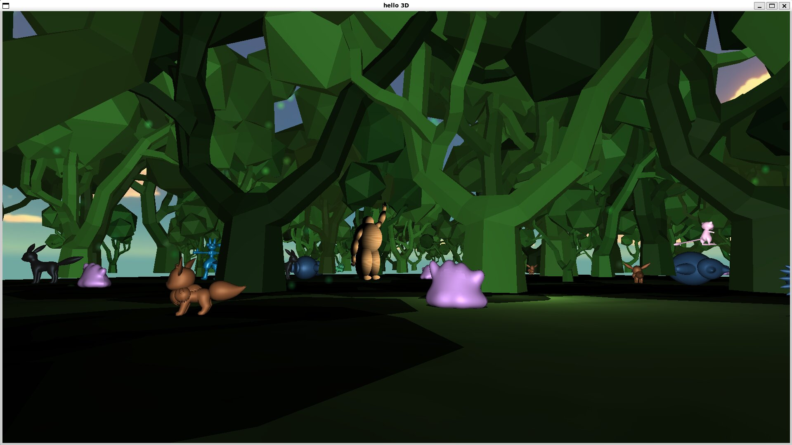
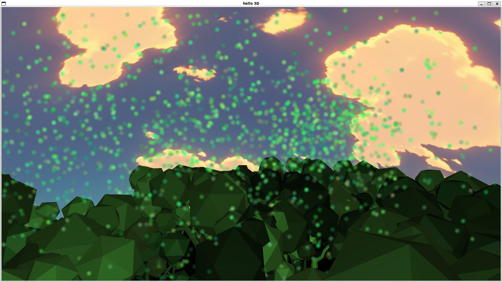
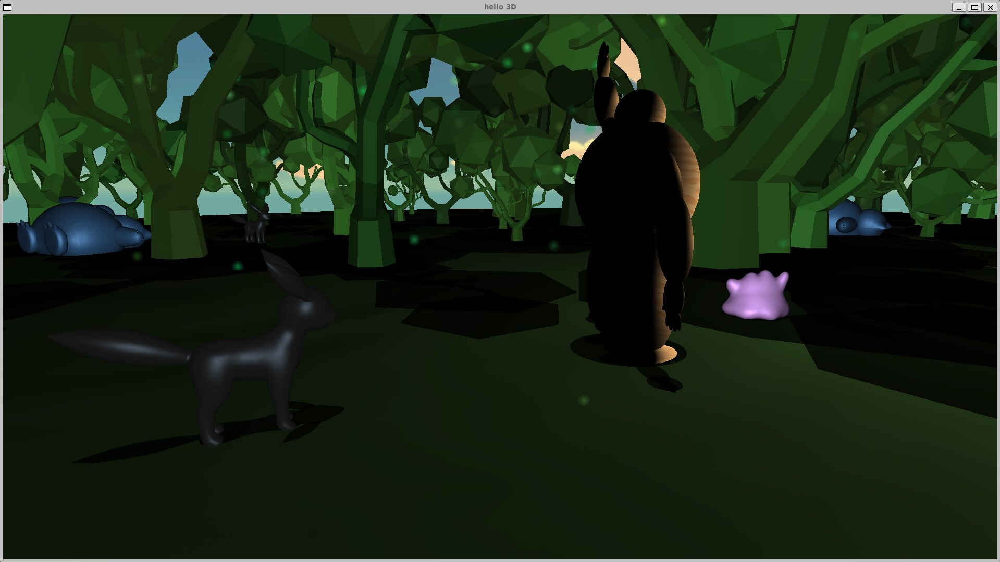
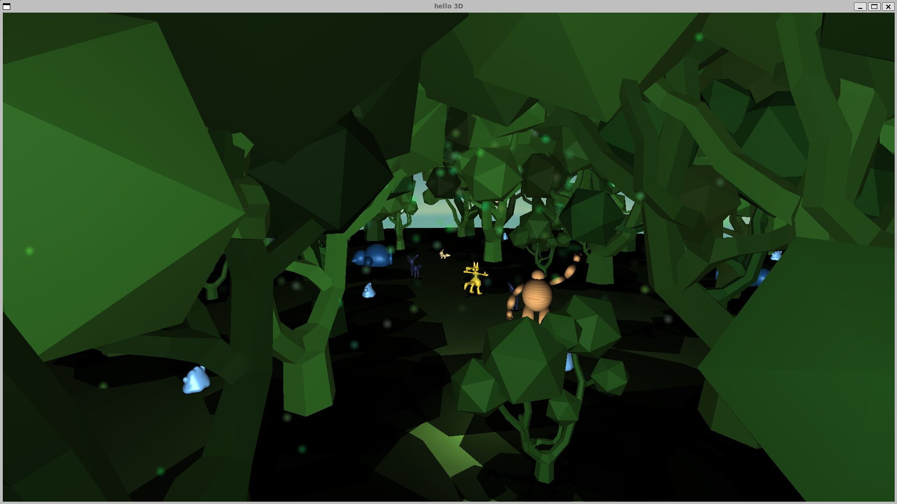
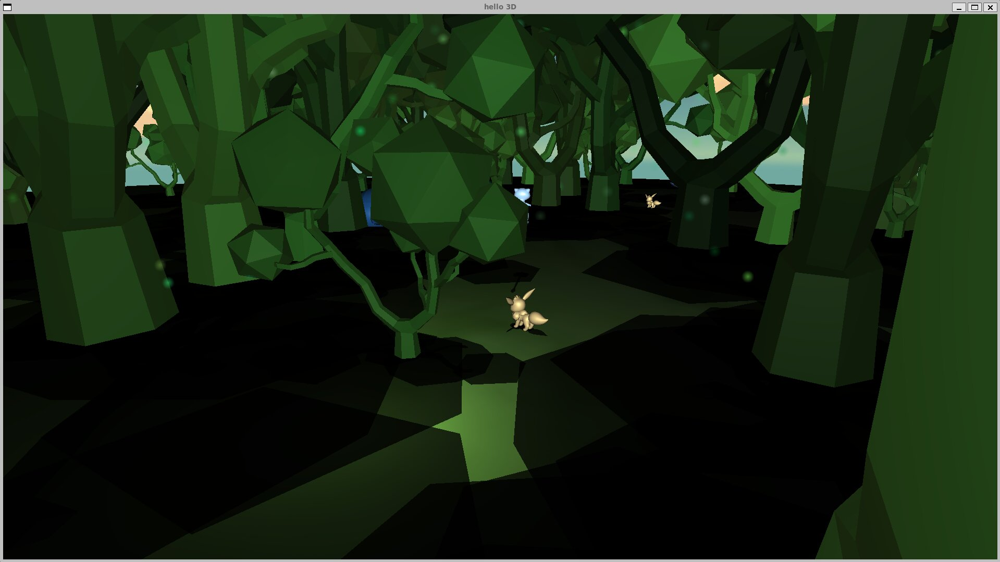
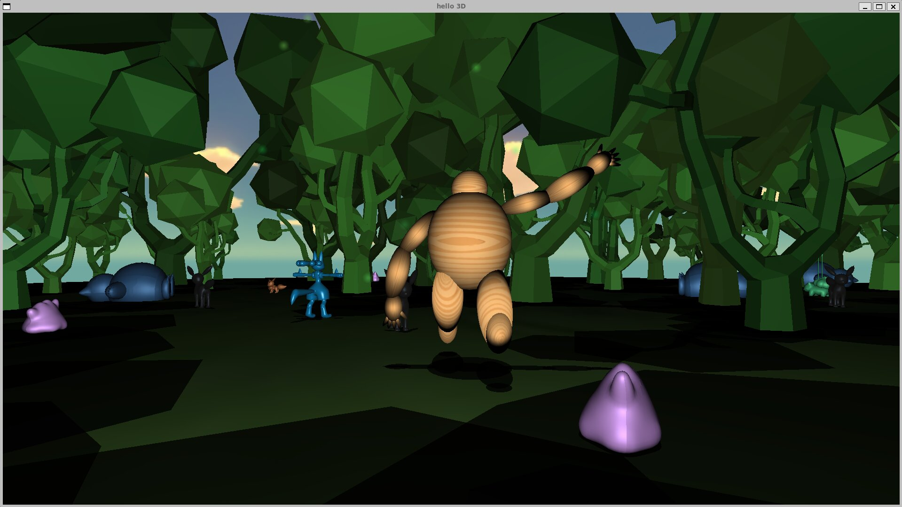

Pokemon Forest

This project is based on the Pokemon game and takes inspiration from
the mysterious Eterna forest found in the Pokemon
Diamond/Pearl/Platinum and its successor series.

# Usage

- Compile the code in a build directory using CMake
- Run the finalproject executable that is created

# Implementation Details

The project features a 3D environment with a forest setting, where
each mesh is mapped to a world tile space. The player can navigate
through the forest, encountering various Pokemon.

The project also includes a particle system that adds visual effects
to the environment, enhancing the overall experience. The particles
are spread throughout the forest, creating a dynamic and lively
atmosphere as players explore the area.

Shadows are implemented to create a more immersive and realistic
environment, allowing players to see the effects of light and shadow
as they explore the forest. Depth testing is disabled to ensure that
the shadows are rendered correctly, even when they overlap with
other objects in the scene.

The project also includes shiny Pokemon, which are rare variants of
regular Pokemon with different color schemes. The Pokemon can be
toggled to turn into shiny versions using the M key.

The project features dynamic lighting that enhances the visual
appeal of the environment. The lighting can be moved in the y
direction using the Q and E keys, in the x direction using the left
and right arrow keys, and in the z direction using the up and down
arrow keys. This allows players to create different lighting effects
and moods as they explore the forest.

The wooden figure can be toggled to animate a run in place as well
as a wave using the X key.

# References

- [Depth testing](https://learnopengl.com/Advanced-OpenGL/Depth-testing)
- [Shiny pokemon](https://pokemondb.net/pokedex/shiny)
